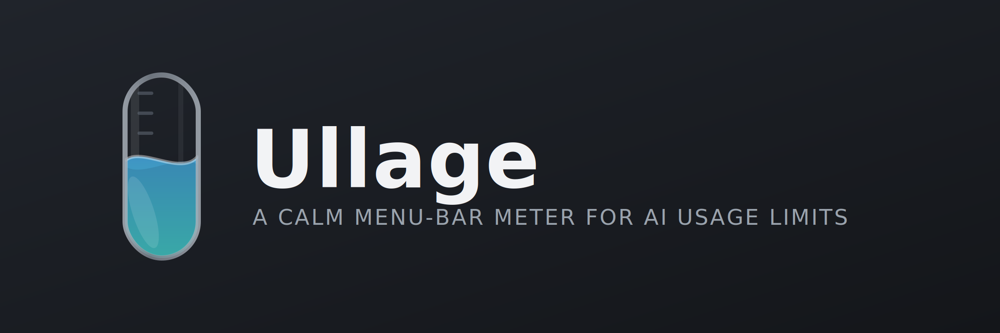
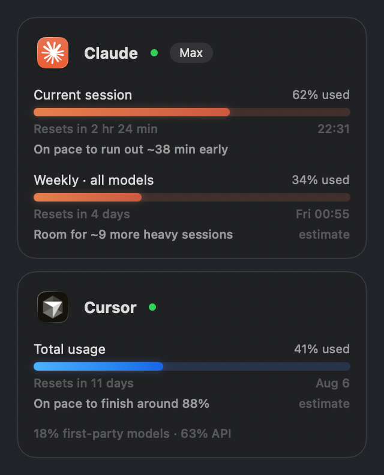
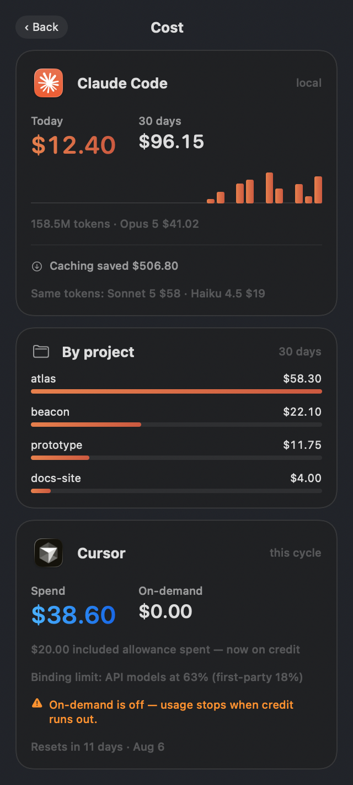
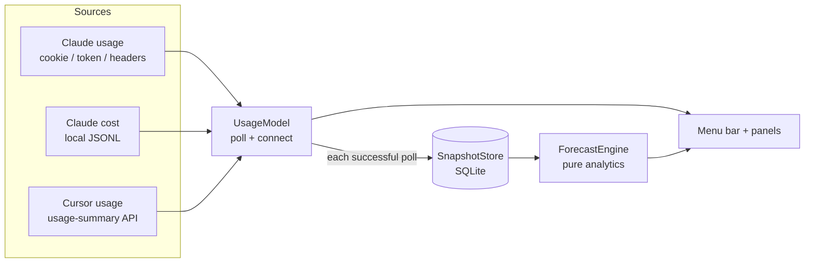
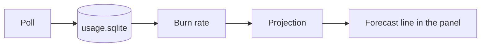

# Ullage

<p align="center">
  
</p>

<p align="center">
  
  
  
  
  <a href="https://github.com/FR1EDDY/Ullage/actions/workflows/ci.yml"></a>
</p>

<p align="center">
  macOS 13+ &nbsp;|&nbsp; ~1.5 MB download &nbsp;|&nbsp; Native Swift/SwiftUI &nbsp;|&nbsp; No dependencies
</p>

Claude and Cursor show your personal active usage, but checking those pages while you work costs you time. So I made Ullage: usage, costs, and forecasting in the menu bar, which cuts distractions when you're focused.

*Ullage* is the empty space left in a container — how much room you still have. That's what the meters are measuring.

```
◍ 21%   ◆ 18%
```

The badge uses each app's real icon, flattened into a monochrome stencil, next to the % used.

---

## How it looks

<p align="center">
  <video src="docs/demo.mp4" width="360" controls playsinline>
    <a href="docs/demo.mp4">Watch the demo</a>
  </video>
</p>

<p align="center">
  
  &nbsp;&nbsp;
  
</p>

<p align="center"><em>Screenshots use sample data.</em></p>

---

## Install

### DMG

1. Grab the latest DMG from [Releases](https://github.com/FR1EDDY/Ullage/releases/latest).
2. Open it and drag **Ullage** into Applications.

This build is ad-hoc signed, not notarised.

**Right-click the app → Open → Open.** Just once. After that it opens normally.


### Homebrew

```sh
brew install --cask fr1eddy/ullage/ullage
```

---

## What it does

Ullage lives in the menu bar and tracks two things:

- **Claude** — 5-hour session window + 7-day weekly window
- **Cursor** — monthly billing cycle

Open the panel and each window gets a meter, a reset time on your local clock, and a forecast that says what it actually means — like *on pace to run out about 55 minutes before this window resets*. The burn rate itself is tucked in the tooltip.

Hit `$` in the footer for the cost panel: today, last 30 days, a daily chart, spend by project, whether prompt caching actually saved you money or not, plus Cursor's cycle spend next to it.

Also in the footer: refresh, a floating always-on-top HUD if you want numbers in a corner, settings, quit.

If you already use Claude Code, Claude usage usually just works with zero setup.

### Connecting an account

Click **Connect** on a card and the real login page opens in a small window. You sign in on the actual site; Ullage grabs the session cookie into Keychain when it shows up. No scripts, no copy-pasting cookies by hand.

### Settings

- **Launch at login**
- **Refresh interval** — 5, 10, or 15 minutes. Claude's rate limits can still slow things down when they need to.
- **Menu bar** — which platforms get a % up top. Cap is two; more than that gets messy.
- **Connections** — connect / sign out per platform.

ChatGPT, Gemini, and Kimi are in the list as planned.

---

## How it works


### Architecture



| Piece | Where it lives | Role |
|---|---|---|
| App entry / menu bar | `UllageApp.swift` | `MenuBarExtra` host; stencil icons + percentages |
| Orchestration | `UsageModel.swift` | Polling, sign-in, wiring providers to UI |
| Providers | `Providers/` | Claude usage, Claude cost, Cursor, Keychain, pricing, registry |
| Persistence | `Persistence/SnapshotStore.swift` | Time series for forecasting |
| Forecasting | `Analytics/` | Burn rate, projections, anomaly — pure functions |
| UI | `Views/` | Main panel, cost panel, settings, HUD, login window |

Adding another platform is supposed to be boring: one row in `ProviderRegistry`, a provider file, a case in `UsageModel.connection(for:)`. The views just loop the registry instead of hardcoding Claude and Cursor everywhere.

### Where the numbers come from

**Claude usage** — three paths, in order:

1. Cookie from in-app sign-in (same one claude.ai settings uses)
2. Claude Code token already on disk / Keychain
3. `anthropic-ratelimit-*` headers from a tiny `api.anthropic.com` probe

**Claude cost** — fully offline from `~/.claude/projects/**/*.jsonl`. Tokens get priced from a bundled table (`Sources/Ullage/Resources/model_prices.json`). Unknown models show as *unpriced*, never $0 — a fake zero is worse than a missing number. Want custom rates? Drop the same shape at `~/Library/Application Support/Ullage/model_prices.json`. Entries there win.

**Cursor** — one authenticated hit to `cursor.com/api/usage-summary`, same endpoint their dashboard uses. Usage and spend both come from that one response.

### Forecasting

Every good poll writes a snapshot to SQLite. `ForecastEngine` pulls recent history and runs it through small pure functions in `Analytics/`:

- **Burn rate** — % points per hour
- **Session / window projection** — finish early, on time, or with room left
- **Anomaly** — flags a runaway session when burn looks nothing like your recent baseline



### Privacy and what touches the network

No telemetry. No analytics. No Ullage account. The only network calls are to the providers you're already signed into.

| Host | Why |
|---|---|
| `claude.ai` | Usage endpoint for the in-app sign-in path; the sign-in window itself |
| `api.anthropic.com` | Usage endpoint; optional 1-token probe if the other Claude paths fail |
| `cursor.com` | Usage summary; the sign-in window itself |

Credentials stay in macOS Keychain. Not logged, not sitting in plaintext on disk, not sent anywhere except the provider they belong to.

On disk under `~/Library/Application Support/Ullage/`:

- `usage.sqlite` — % over time, kept for ~180 days
- `cost-cache.json` — parsed token counts so relaunch doesn't re-chew giant transcript trees

Nuke everything, including credentials:

```sh
rm -rf ~/Library/Application\ Support/Ullage
rm -f ~/Library/Preferences/com.ullage.app.plist
security delete-generic-password -s com.ullage.cursor -a cursor
security delete-generic-password -s com.ullage.cursor -a claude-session
```

Both credentials live under one Keychain service (`com.ullage.cursor`) on separate accounts — leftover naming from when Cursor was the only provider. `brew uninstall --zap --cask ullage` cleans the files; it can't touch Keychain, so do that yourself.

---

## Troubleshooting

**Claude shows `…` and never resolves.** None of the three credential paths worked. Hit **Connect** on the Claude card and sign in.

**Cursor shows `—`.** Not connected, or the cookie died. Sign out and connect again.

**Refresh is greyed out.** Claude rate-limited the last poll. It comes back when cooldown ends — tooltip says when.

**Some cost lines say *unpriced*.** Model isn't in the pricing table. Add it with the override file above.

**Nothing in the menu bar.** Ullage is `LSUIElement` on purpose — no Dock icon, no app switcher. If the bar is packed, macOS just hides things. Quit something else up there and relaunch.

---

## Build from source

Needs macOS 13+ and Swift 5.9. No third-party deps — SQLite and CryptoKit are already on the system, which is why the download stays around 1.5 MB.

```sh
swift build
swift test
Scripts/package_app.sh          # universal .app + DMG into dist/
Scripts/package_app.sh --arch arm64 --no-dmg   # faster local loop
```

CI builds, tests, and packages on every push, and checks the bundle: `LSUIElement` set, pricing table present, ad-hoc signature valid, fat binary for both arches.

To cut a release (needs authenticated `gh`):

```sh
echo "0.2.0" > VERSION
Scripts/release.sh
```

`VERSION` is the source of truth for the tag, the app bundle, and the cask. The script tags, publishes the GitHub release, and prints the `version` + `sha256` for you to paste into the `homebrew-ullage` tap. It does **not** push the tap for you.

---

## Licence

MIT — see [LICENSE](LICENSE).

Ullage is not affiliated with Anthropic or Anysphere. It shows the Claude and
Cursor app icons to identify which service each card reports on — read from the
installed app when it's present, and from a bundled copy of the same artwork
when it isn't (`Scripts/refresh_provider_icons.sh`). Those icons are the
property of their respective owners.
