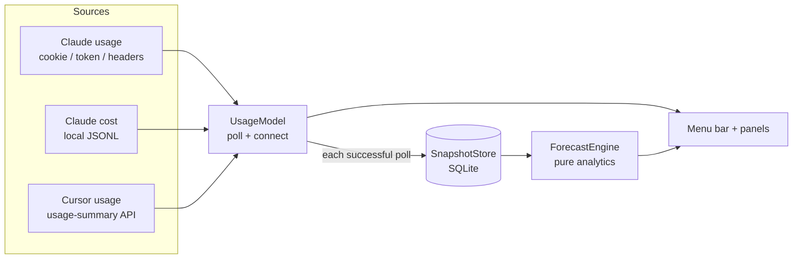

# Ullage

<p align="center">
  <strong>A calm macOS menu-bar meter for AI usage limits and cost</strong>
</p>

<p align="center">
  
  
  
  
  <a href="https://github.com/FR1EDDY/Ullage/actions/workflows/ci.yml"></a>
</p>

<p align="center">
  macOS 13+ &nbsp;|&nbsp; ~1.5 MB download &nbsp;|&nbsp; Native Swift/SwiftUI &nbsp;|&nbsp; No dependencies
</p>

Claude and Cursor both tell you how much you have left, in two different places, in their own terms, and only when you go looking. Ullage puts both in the menu bar, converts them into the same shape, and adds the part neither provides: whether your current pace runs out before the window resets.

*Ullage* is the unused space left in a container — how much room you still have. That is what the meters measure.

```
◍ 21%   ◆ 18%
```

The badge shows each platform's own app icon, flattened to a monochrome stencil, next to its percentage used.

---

## See it in action

<p align="center">
  <video src="docs/demo.mp4" width="360" controls playsinline>
    <a href="docs/demo.mp4">Watch the demo</a>
  </video>
</p>

<p align="center">
  
  &nbsp;&nbsp;
  
</p>

<p align="center"><em>Screenshots use sample data.</em></p>

---

## Install

### DMG

1. Download the latest DMG from [Releases](https://github.com/FR1EDDY/Ullage/releases/latest).
2. Open it and drag **Ullage** into Applications.

The build is ad-hoc signed rather than notarised — a deliberate choice, since notarisation requires a paid Apple Developer account. The cost of that choice lands on first launch: macOS will say the developer cannot be verified.

**Right-click the app → Open → Open.** Once. It launches normally after that.

Same thing from the terminal, if you prefer:

```sh
xattr -dr com.apple.quarantine /Applications/Ullage.app
```

### Homebrew

A cask is ready in [`Distribution/ullage.rb`](Distribution/ullage.rb) but the tap is not published yet, so this does not work today. Once the `FR1EDDY/homebrew-ullage` tap exists it will be one command:

```sh
brew install --cask fr1eddy/ullage/ullage
```

Homebrew strips the quarantine flag itself, so the Gatekeeper dance above will not apply to that path.

---

## What it does

Ullage lives in the menu bar and tracks two things at once:

- **Claude** — the 5-hour session window and the 7-day weekly window
- **Cursor** — the monthly billing cycle

Open the panel and each window gets a meter, a reset time in your own clock, and a forecast line stated as a consequence rather than a rate: *on pace to run out about 55 minutes before this window resets*. The raw burn rate stays in the tooltip.

The `$` button in the footer opens the cost panel: today and the last 30 days, a daily chart, spend broken out by project, what prompt caching actually saved or cost you, and Cursor's cycle spend alongside it.

Other things in the footer: refresh, a floating always-on-top HUD you can leave in a corner, settings, quit.

If you already use Claude Code, Claude usage often works with no setup at all.

### Connecting an account

Click **Connect** on a platform's card and the real login page opens in an embedded window. You sign in on the genuine site; the app lifts the session cookie into the Keychain when it appears. No scripts, no hand-pasted cookies.

### Settings

- **Launch at login**
- **Refresh interval** — 5, 10 or 15 minutes. Claude's own rate limits still slow polling when they need to.
- **Menu bar** — which platforms show a percentage up top. Two maximum; past that the bar gets crowded.
- **Connections** — connect or sign out per platform.

ChatGPT and Gemini are listed in the app as planned, marked as such rather than hidden.

---

## How it works

You should not have to read `Sources/` to understand the shape of the app. This section is the map.

### Architecture



| Piece | Where it lives | Role |
|---|---|---|
| App entry / menu bar | `UllageApp.swift` | `MenuBarExtra` host; stencil icons + percentages |
| Orchestration | `UsageModel.swift` | Polling, sign-in, wiring providers to UI |
| Providers | `Providers/` | Claude usage, Claude cost, Cursor, Keychain, pricing, registry |
| Persistence | `Persistence/SnapshotStore.swift` | Time series for forecasting |
| Forecasting | `Analytics/` | Burn rate, projections, anomaly — pure functions |
| UI | `Views/` | Main panel, cost panel, settings, HUD, login window |

Adding a platform is meant to be a listing change: one entry in `ProviderRegistry`, a provider file, a case in `UsageModel.connection(for:)`. Views iterate the registry instead of naming Claude and Cursor.

### Where the numbers come from

**Claude usage** — three paths, tried in order:

1. An in-app sign-in cookie (the same one claude.ai's own settings page uses)
2. A Claude Code token already on disk or in the Keychain
3. `anthropic-ratelimit-*` response headers from a minimal `api.anthropic.com` probe

**Claude cost** — read entirely offline from `~/.claude/projects/**/*.jsonl`. Token counts and models are priced from a bundled table (`Sources/Ullage/Resources/model_prices.json`). Unknown models show as *unpriced*, never as $0. Drop a file of the same shape at `~/Library/Application Support/Ullage/model_prices.json` to override or extend it — entries there win per model.

**Cursor** — one authenticated call to `cursor.com/api/usage-summary`, the same endpoint the Cursor dashboard uses. Usage and spend both come from that single request.

### Forecasting

Every successful poll writes a snapshot to SQLite. `ForecastEngine` loads recent history and hands it to small pure functions in `Analytics/`:

- **Burn rate** — percent-points consumed per hour
- **Session / window projection** — whether you finish early, on time, or with room left
- **Anomaly** — a runaway-session flag when burn breaks from your recent baseline


### Privacy and what touches the network

No telemetry. No analytics. No Ullage account. Nothing leaves your machine except requests to the providers you are already signed in to.

| Host | Why |
|---|---|
| `claude.ai` | Usage endpoint for the in-app sign-in path; the sign-in window itself |
| `api.anthropic.com` | Usage endpoint; optional 1-token probe if the other Claude paths fail |
| `cursor.com` | Usage summary; the sign-in window itself |

Credentials live in the macOS Keychain only. They are never logged, never written to disk in plaintext, and never sent anywhere but the provider they belong to.

On disk, under `~/Library/Application Support/Ullage/`:

- `usage.sqlite` — usage percentages over time, pruned to 180 days
- `cost-cache.json` — parsed token counts, so a relaunch does not re-read large transcript trees

To remove everything, including the stored credentials:

```sh
rm -rf ~/Library/Application\ Support/Ullage
rm -f ~/Library/Preferences/com.ullage.app.plist
security delete-generic-password -s com.ullage.cursor -a cursor
security delete-generic-password -s com.ullage.cursor -a claude-session
```

Both credentials sit under the one `com.ullage.cursor` service, on separate accounts — a naming wart from when Cursor was the only provider. `brew uninstall --zap --cask ullage` will cover the files once the tap is published, but never the Keychain items; Homebrew cannot touch those.

---

## Troubleshooting

**Claude shows `…` and never resolves.** No credential was found on any of the three paths. Click **Connect** on the Claude card and sign in.

**Cursor shows `—`.** Not connected, or the session cookie expired. Sign out and connect again.

**Refresh is greyed out.** Claude rate-limited the last poll; the button re-enables when the cooldown passes. Its tooltip says so.

**Some cost lines say *unpriced*.** The model is not in the pricing table. Add it via the override file above.

**Nothing appears in the menu bar.** Ullage is `LSUIElement` — no Dock icon and no app-switcher entry by design. If the bar is full, macOS hides items silently; quit something else up there and relaunch.

---

## Build from source

Requires macOS 13+ and a Swift 5.9 toolchain. No third-party dependencies — SQLite and CryptoKit come from the system, which is why the download stays around 1.5 MB.

```sh
swift build
swift test
Scripts/package_app.sh          # universal .app + DMG into dist/
Scripts/package_app.sh --arch arm64 --no-dmg   # faster local loop
```

CI runs build, tests, and the packaging script on every push, and verifies the assembled bundle: `LSUIElement` set, pricing table present, ad-hoc signature valid, both architectures fat.

To cut a release (needs an authenticated `gh`):

```sh
echo "0.2.0" > VERSION
Scripts/release.sh
```

`VERSION` is the single source of truth — the tag, the bundle and the cask all read from it. The script tags, publishes the GitHub release, and prints the `version` and `sha256` to paste into the cask in the `homebrew-ullage` tap. It deliberately does not push to the tap itself.

---

## Licence

MIT — see [LICENSE](LICENSE).